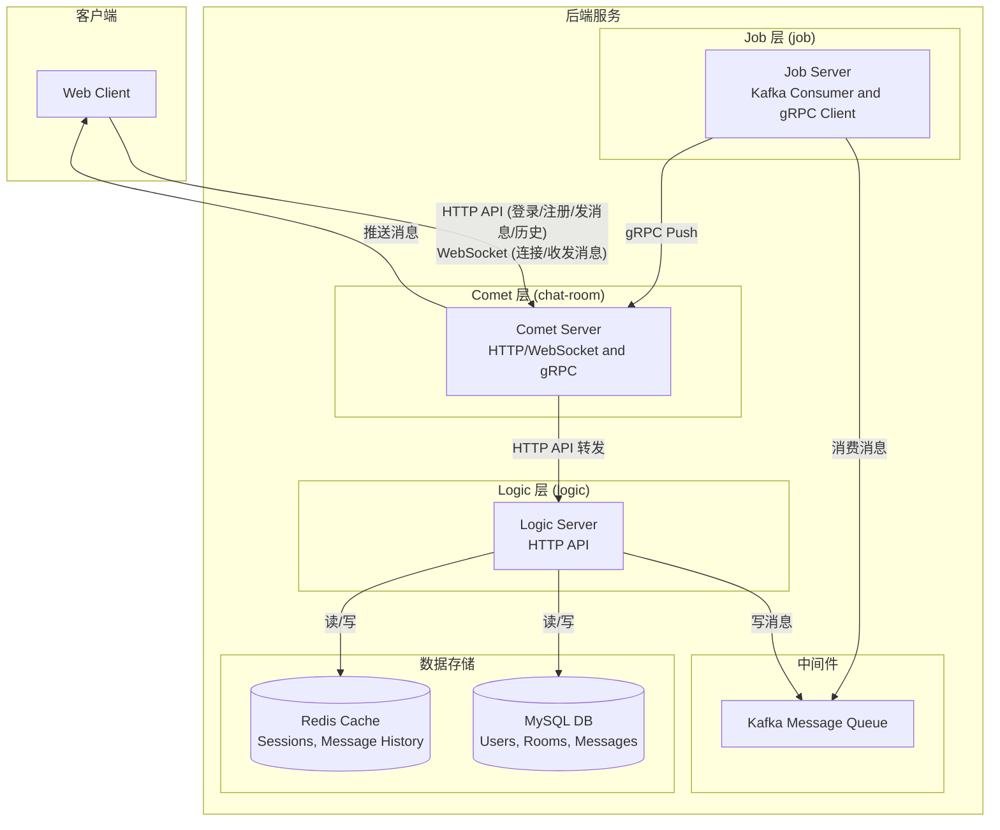
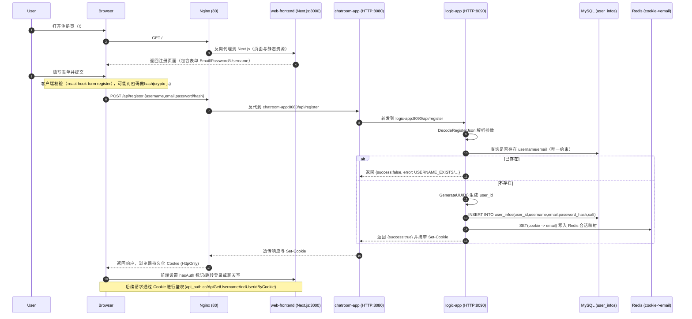
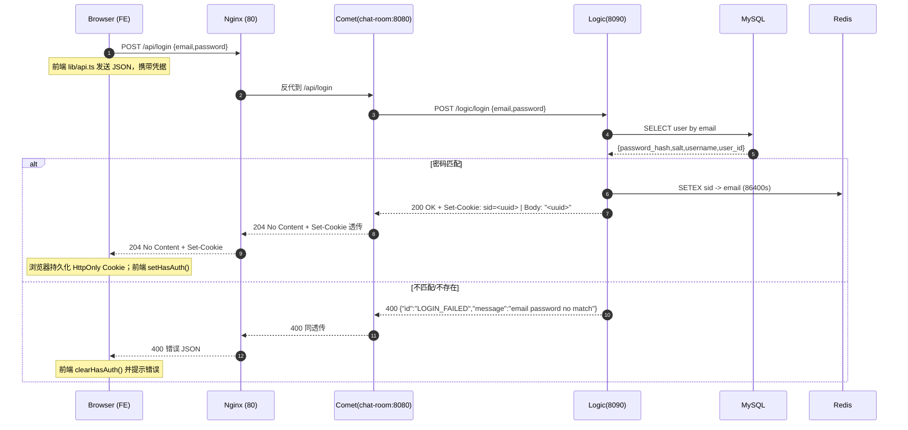
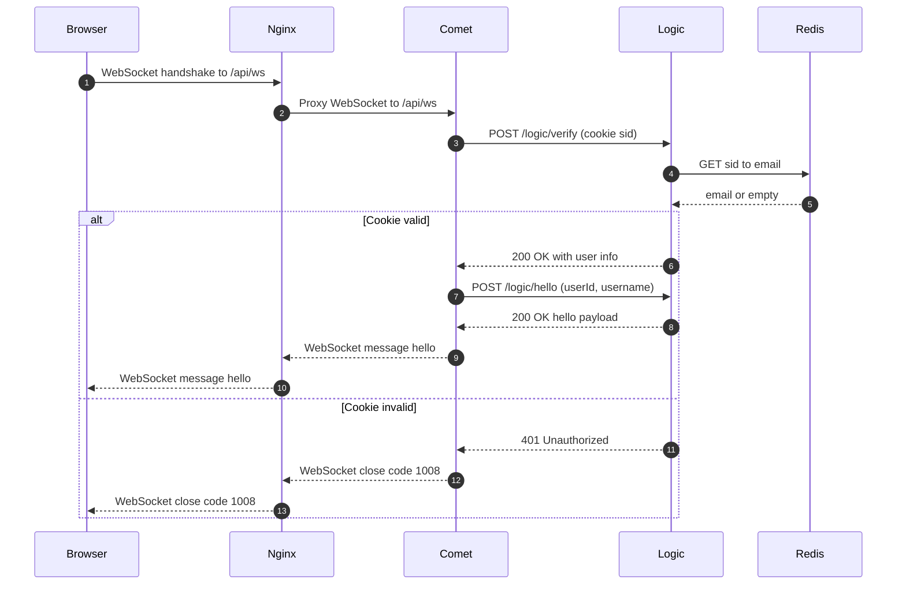
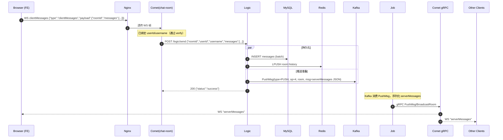
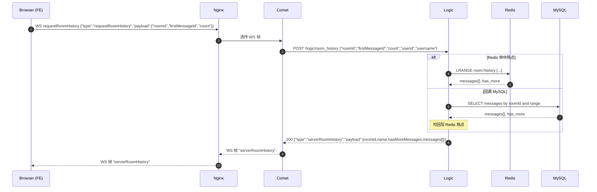
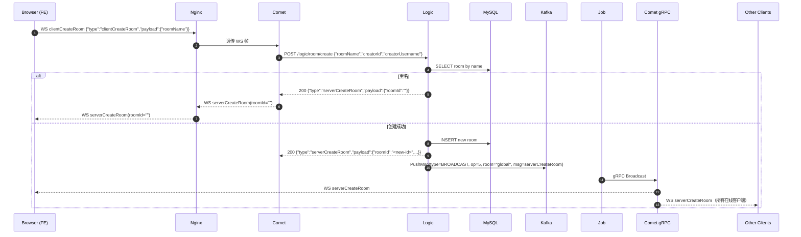
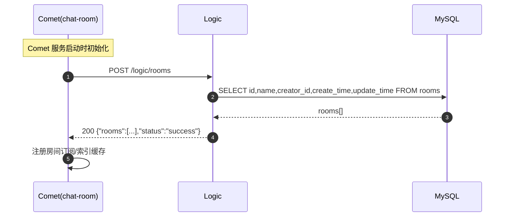

# 分布式实时消息推送系统

分布式实时消息推送系统通过三级解耦架构，实现 comet 层，job 层和 logic 层，使用 Kafka 和 gRPC 实现后端服务间通信；本系统将连接管理、业务逻辑与消息推送分离，确保了其高可用性和水平扩展能力，为需要高并发、低延迟消息推送的场景提供稳定可靠的后端服务；本系统支持房间隔离消息、全局广播等多种消息模式，提供完整的用户认证、消息持久化与历史消息查询等功能。

## 一、项目依赖与部署

### 1.1 环境依赖

**前端**

> - **Node.js**: >= 18.x
> - **npm**: >= 9.x
> - **依赖包**:
>   - `next`, `react`, `react-dom`: 核心框架。
>   - `axios`: 用于HTTP请求。
>   - `crypto-js`, `md5`: 用于加密。
>   - `@mui/material`, `tailwindcss`: UI组件库和样式。
>   - `jest`, `@testing-library/react`: 测试框架。

**后端**

> - Ubuntu 20.04
>
> - g++  10.5.0
>
> - CMAKE 3.16.3
>
> - 第三方库
>
>   ```c++
>   #include<>// muduo, gRPC, Protocol Buffers, librdkafka, hiredis, jsoncpp
>   ```
>
> - 中间件
>
>   - MySQL 8.0.42
>   - Redis 6.0.16
>   - Kafka 3.7

### 1.2 开发环境部署

**前端**

```bash
cd client/web
npm install			# 安装前端依赖
npm run dev			# 启动前端服务
```

**后端**

启动前先确保安装了后端所需要的第三方库和中间件环境。

```bash
# 1. 使用 server/create_tables.sql 初始化数据库

# 2. 构建后端服务，comet层，job层和logic层分别构建

# 2.1 comet 层
cd server/application/chat-room
mkdir build
cd build
cmake ..
make

# 2.2 job 层
cd server/application/job
mkdir build
cd build
cmake ..
make

# 2.3 logic 层
cd server/application/logic
mkdir build
cd build
cmake ..
make

# 3. 启动后端服务，启动顺序为：loigc --> job --> chatroom
cd server/application/logic/build/bin
./logic
cd server/application/job/build/bin
./job
cd server/application/chatroom/build/bin
./chatroom

```

### 1.3 端口总结

该消息推送系统启动后，占用端口如下。

| 服务      | 端口   |
| :-------- | :----- |
| nginx     | 80     |
| 前端      | 3000   |
| comet 层  | 8080   |
| logic 层  | 8090   |
| Job 层    | random |
| gRPC      | 50051  |
| Kafka     | 9092   |
| redis     | 6379   |
| mysql     | 3306   |
| zookeeper | 2181   |

## 二、技术栈

项目做完之后，根据所使用的技术栈来复习八股可能会好一点。

> c++17 & 单例模式 & muduo网络库 & MySQL & redis & gRPC & Kafka & 微服务思想

## 三、后端架构

分布式实时消息推送系统采用分层的微服务架构思想。



> **comet层**，由多个 Comet 节点组成，每个节点是websocket的网关服务。
>
> - 接收并维持客户端的 websocket 长连接；
> - 将客户端消息转发给后端 logic，接收job的推送消息，执行对应的业务逻辑，并且将响应结果通过websocket连接实时推送给客户端；
> - 支持水平扩展，应对海量 websocket 连接；
> - 通信协议，与客户端使用 websocket 连接通信，job层通过gRPC用 `comet_service`，与logic层通过`curl`库通信。
>
> **logic层**，由多个 logic 服务节点组成，处理核心业务逻辑。
>
> - 用户认证，会话管理；
>
> - 消息合法性校验、内容处理；
> - 调用存储层进行数据持久化或查询；
>
> - 将需要异步处理或广播的消息发布到 Kafka 中。
>
> **job 层**：由多个job节点组成，负责消息的消费与推送。
>
> - 从 Kafka 消费消息（如群聊、创建房间、系统通知）；
> - 查询用户在线状态和连接信息（哪个comet节点）；
> - 通过 gRPC 调用对应的 comet 节点，将消息实时推送给客户端；
> - 离线（非登录）消息补偿。

## 四、通信协议格式

采用两种主要的数据格式：**Protocol Buffers (Protobuf)** 用于后端内部服务间的高效通信，**JSON**用于前后端之间的HTTP/WebSocket通信。

### 4.1 后端服务间通信协议

`ChatRoom.Protocol.proto`定义所有消息的基础信封（Envelope），具体的消息内容包装在 `body` 字段中。

> `chat-room/rpc/ChatRoom.Protocol.proto`
>
> ```protobuf
> message Proto {
>     int32 ver = 1;
>     int32 op = 2;
>     int32 seq = 3;
>     bytes body = 4;
> }
> ```
>
> - `ver`：协议版本；
> - `op`：操作码，用于区分消息类型；
> - `seq`：序列号，用于请求-响应匹配；
> - `body`：序列化后的Protobuf， 实际的消息内容。

`ChatRoom.Comet.proto` 定义 `Job` 层与 `Comet` 层之间的gRPC服务接口。

> `chat-room/rpc/comet_service.h`:
>
> ```c++
> class CometServiceImpl final : public Comet::Comet::Service {
> public:
>     grpc::Status PushMsg(grpc::ServerContext* context, 
>                         const Comet::PushMsgReq* request,
>                         Comet::PushMsgReply* response) override;
> 
>     grpc::Status Broadcast(grpc::ServerContext* context,
>                          const Comet::BroadcastReq* request, 
>                          Comet::BroadcastReply* response) override;
> 
>     grpc::Status BroadcastRoom(grpc::ServerContext* context,
>                               const Comet::BroadcastRoomReq* request,
>                               Comet::BroadcastRoomReply* response) override;
> 
>     grpc::Status Rooms(grpc::ServerContext* context,
>                       const Comet::RoomsReq* request,
>                       Comet::RoomsReply* response) override;
> };
> ```
>
> - `PushMsg`: 向指定的一个或多个用户推送消息（redis中的cookies）；
> - `Broadcast`: 向所有在线用户广播消息（如系统公告）；
> - `BroadcastRoom`: 向指定房间内的所有用户广播消息；
> - `Rooms`: 获取所有房间列表（`Job`层不使用，可能为其他服务预留）。

`ChatRoom.Job.proto` 定义logic层发送到Kafka的消息格式。

> `logic/proto/ChatRoom.Job.proto`
>
> ```protobuf
> message PushMsg {
>     enum Type {
>         PUSH = 0;   // 推送给指定用户
>         ROOM = 1;   // 推送给指定房间
>         BROADCAST = 2; // 广播给所有人
>     }
>     
>     Type type = 1;
>     int32 operation = 2;
>     int32 speed = 3;
>     string server = 4;
>     string room = 5;
>     repeated string keys = 6;
>     bytes msg = 7;
> }
> ```
>
> - `type`: 消息类型 (PUSH, ROOM, BROADCAST)。
> - `operation`: 操作码，与 `ChatRoom.Protocol.proto` 中的 `op` 对应；
> - `room`: 目标房间ID；
> - `keys`: 目标用户ID列表；
> - `msg`: 消息体，通常是序列化后的JSON字符串，用于前端解析。

### 4.2 前后端通信协议

后端可以解析前端发送 WS 帧的 JSON 数据 `type` 字段值为：

```json
{
  type = "clientMessages" or "requestRoomHistory" or "clientCreateRoom";
  ....
}
```

 前端可以解析后端发送 WS 帧的 JSON 数据 `type` 字段值为：

```json
{
  type = "hello" or "serverMessages" or "serverRoomHistory" or "serverCreateRoom";
  ....
}
```

#### 4.2.1 注册

> **前端 ==> comet层**
>
> - 请求行：`POST /api/create-account`；
>
> - 请求体：
>
>   ```json
>   { 
>     "username": "string", 
>    	"email": "string", 
>    	"password": "string"
>   }
>   ```
>
> **comet 层 ==> logic 层**
>
> - 接口：`http_conn.cc::_HandleRegisterRequest(...) ==> LogicClient.registerUser(...)`；
>
> - 请求行：`POST /logic/register`；
>
> - 请求体同上。
>
> **logic 层处理 ==> comet 层**
>
> - 接口：`api_register.cc::ApiRegisterUser(...)`；
>
> - 成功：生成 UUID 作为用户 Cookie，返回`HTTP/1.1 200 OK Set-Cookie: sid=UUID` ；
>
>   - 响应体：UUID 文本字符串；
>
> - 失败：返回 `HTTP 400`；
>
>   - 响应体：
>
>     ```json
>     { "id": "USERNAME_EXISTS" | "EMAIL_EXISTS" | "", "message": "..." }
>     ```
>
> **comet层 ==> 前端**
>
> - 成功：`HTTP 204 No Content + Set-Cookie: sid=UUID`；
> - 失败：`HTTP 400 + Failed JSON` 。
>
> **前端类型**
>
> - 成功：`{ type: "ok" }`；
> - 失败：`{ type: "USERNAME_EXISTS" | "EMAIL_EXISTS" }`。

#### 4.2.2 登录

> **前端 ==> comet 层**
>
> - 请求 URL：`POST /api/login`；
>
> - 请求体：
>
>   ```json
>   { "email": "string", "password": "string" }
>   ```
>
> **comet 层 ==> logic 层**
>
> - 接口：`http_conn.cc::_HandleLoginRequest(...) ==> LogicClient.loginUser(...)`；
>
> - 请求行：`POST /logic/login`。
>
> **logic 层处理 ==> comet 层**
>
> - 接口：`api_login.cc::ApiLoginUser(...)`；
>
> - 成功：生成 UUID 作为用户 Cookie，返回 `HTTP/1.1 200 OK Set-Cookie: sid=<uuid>` ；
>
>   - 响应体：UUID 文本字符串。
>
> - 失败：返回 `HTTP 400` ；
>
>   - 响应体：
>
>     ```json
>     { "id": "LOGIN_FAILED" | "", "message": "email password no match" }
>     ```
>
> **comet层 ==> 前端**
>
> - 成功：`HTTP 204 No Content + Set-Cookie: sid=UUID`；
> - 失败：`HTTP 400 + Failed JSON `。
>
> **前端类型**
>
> - 成功：`{ type: "ok" }`；
> - 失败：`{ type: "LOGIN_FAILED" }`。

#### 4.2.3 认证

> **客户端 ==> comet层**
>
> - 握手请求头携带 `Cookie: sid=UUID`；
>
> **comet层 ==> Logic层**
>
> - 请求行：`POST /logic/verify`；	
>
> - 接口：`websocket_conn.cc::OnRead(...) ==> LogicClient.verifyUserAuth()`；
>
> - 请求体：
>
>   ```json
>   { "cookie": "<sid>" }
>   ```
>
> **logic层处理 ==> comet层**
>
> - 成功响应体：
>
>   ```json
>   { 
>     "success": true,
>     "user_id": "string",
>     "username": "string",
>     "email": "string"
>   }
>   ```
>
> - 失败响应体：
>
>   ```json
>   { 
>     "success": false,
>     "error": "Invalid cookie or user not found"
>   }
>   ```
>
> **comet层处理**
>
> - 成功：保存 `user_id & username`，订阅默认房间，随后发送 hello 帧；
> - 失败：发送 `webocket close` 帧 `code=1008`，前端跳转登录。

#### 4.2.4 hello帧

> **comet层 ==> Logic层**
>
> - 请求ULR：`POST /logic/hello`；
>
> - 接口：`websocket_conn.cc::SendHelloMessage(...)`；
>
> - 请求体：
>
>   ```json
>   { 
>     "userId": "<user_id>",
>     "username": "<username>"
>   }
>   ```
>
> **logic层处理 ==> comet层**
>
> - 接口：`main.cc::handleHello(...)`；
>
> - 响应状态行：`HTTP/1.1 200 OK`；
>
> - 响应体：
>
>   ```json
>   {
>     "type": "hello",
>     "payload": {
>       "me": { "id": "string", "username": "string" },
>       "rooms": [
>         {
>           "id": "room-id",
>           "name": "room-name",
>           "creator_id": "string",
>           "hasMoreMessages": true,
>           "messages": [
>             {
>               "id": "msg-id",
>               "content": "text",
>               "timestamp": 1690000000000,
>               "user": { "id": "sender-id", "username": "sender" }
>             }
>           ]
>         }
>       ]
>     }
>   }
>   ```
>
> **comet层 ==> 客户端**
>
> - websocket帧发送上述 JSON，`type=hello`。

#### 4.2.5 发送实时消息

> **客户端 ==> comet层**
>
> - 接口：`HTTP/1.1 200 OK::serializeMessagesEvent`；
>
> - WS请求体：
>
>   ```json
>   {
>     "type": "clientMessages",
>     "payload": {
>       "roomId": "room-001",
>       "messages": [ { "content": "Hello!" } ]
>     }
>   }
>   ```
>
> **comet层 ==> logic层**
>
> - HTTP请求体：`POST /logic/send`；
>
> - 接口：`websocket_conn.cc::HandleClientMessages(...) ==> LogicClient.handleSend(...)`；
>
> - 请求体：
>
>   ```json
>   {
>     "roomId": "room-001",
>     "userId": "<user_id>",
>     "username": "<username>",
>     "messages": [ 
>       { 
>         "type": "text",
>         "content": "Hello!" 
>       }
>     ]
>   }
>   ```
>
> **logic层处理 ==> job层（kafka生产者）**
>
> - 接口：`main.cc::handleSend(...)`；
>
> - 生成消息ID（时间戳+序号），获取用户信息，将消息写 Redis 和 MySQL；
> - 封装 `serverMessages` 为 JSON 格式数据；
> - 封装 `protobuf PushMsg(type=PUSH, op=4, room=room_id, msg=JSON)`发送到Kafka消息队列。
>
> **logic层处理 ==> comet层**
>
> - 响应状态行：`HTTP/1.1 200 OK `；
> - 响应体：`{"status":"success"}`。
>
> **job层 ==> comet层（Kafka生产者）**
>
> - 解析logic层的Protobuf消息，创建Protobuf消息，gRPC调用`comet_service.h`中的`BroadcastRoom(...)`。
>
> **comet层 ==> 客户端**
>
> - 封装JSON数据为WS帧，返回给客户端：
>
>   ```json
>   {
>     "type": "serverMessages",
>     "payload": {
>       "roomId": "room-001",
>       "messages": [
>         {
>           "id": "<generated>",
>           "content": "Hello!",
>           "timestamp": 1690000000000,
>           "user": { "id": "<user_id>", "username": "<username>" }
>         }
>       ]
>     }
>   }
>   ```

#### 4.2.6 获取历史消息

> **客户端 ==> comet层**
>
> - WS请求源：`pages/chat.tsx`；
>
> - 请求体：
>
>   ```json
>   {
>     "type": "requestRoomHistory",
>     "payload": {
>       "roomId": "room-001",
>       "firstMessageId": "msg-id-123",
>       "count": 30
>     }
>   }
>   ```
>
> **comet层 ==> logic层**
>
> - 请求行：`POST /logic/room_history`；
>
> - 接口：`websocket_conn.cc::HandleRequestRoomHistory(...) ==> LogicClient.handleRoomHistory(...)`；
>
> - 请求体：
>
>   ```json
>   {
>     "type": "requestRoomHistory",
>     "payload": {
>       "roomId": "room-001",
>       "firstMessageId": "msg-id-123",
>       "count": 30,
>       "userId": "<user_id>",
>       "username": "<username>"
>     }
>   }
>   ```
>
> **logic层处理 ==> comet层**
>
> - 接口：`main.cc::handleRoomHistory(...)`；
>
> - 响应状态行：`HTTP/1.1 200 OK`；
>
> - 响应体：
>
>   ```json
>   {
>     "type": "serverRoomHistory",
>     "payload": {
>       "roomId": "room-001",
>       "name": "",
>       "hasMoreMessages": true,
>       "messages": [
>         {
>           "id": "msg-id",
>           "content": "text",
>           "timestamp": 1690000000000,
>           "user": { "id": "sender-id", "username": "sender" }
>         }
>       ]
>     }
>   }
>   ```
>
> **comet层 ==> 客户端**
>
> - 封装上述 JSON为WS帧，发送给客户端。

#### 4.2.7 创建房间

> **客户端 ==> comet层**
>
> - 接口：`apiSerialization.ts::serializeCreateRoomEvent(...)`；
>
> - WS请求体：
>
>   ```json
>   {
>     "type": "clientCreateRoom",
>     "payload": {
>       "roomName": "dpdk"
>   	}
>   }
>   ```
>
> **comet层 ==> logic层**
>
> - 接口：`websocket_conn.cc::HandleClientCreateRoom(...) ==> LogicClient.handleCreateRoom(...)`；
>
> - 请求行：`POST /logic/room/create`；
>
> - 请求体：
>
>   ```json
>   {
>     "type": "clientCreateRoom",
>     "payload": {
>       "roomName": "dpdk",
>       "creatorId": "<user_id>",
>       "creatorUsername": "<username>"
>     }
>   }
>   ```
>
> **logic层处理 ==>  comet层**
>
> - 房间名重名
>
>   - 响应状态行：`HTTP/1.1 200 OK`；
>
>   - 响应体： 
>
>     ```json
>     {
>       "type": "serverCreateRoom",
>       "payload": {
>         "roomId": "",
>         "roomName": "",
>         "creatorId": "",
>         "creatorUsername": ""
>       }
>     }
>     ```
>
> - 房间创建成功
>
>   - 响应状态行：`HTTP/1.1 200 OK`；
>
>   - 响应体：
>
>     ```json
>     {
>       "type": "serverCreateRoom",
>       "payload": {
>         "roomId": "<new-id>",
>         "roomName": "dpdk",
>         "creatorId": "<user_id>",
>         "creatorUsername": "<username>"
>       }
>     }
>     ```
>
> **logic层处理 ==> job层（kafka生产者）**
>
> - 封装响应 JSON 数据`PushMsg(type=BROADCAST, op=5, room="global", msg=JSON Data)`为Protobuf格式，发送到Kafka消息队列。
>
> **job层 ==> comet 层（Kafka消费者）**
>
> - 解析logic层的Protobuf消息，创建Protobuf消息，gRPC调用`comet_service.cc::Broadcast(...)`。
>
> **comet层 ==> 客户端**
>
> - 封装上述JSON数据为WS帧，`comet_service.cc::BroadcastRoom(...)`广播消息给每一个WS连接；
>
>   - 房间创建成功：前端新增房间并公告；
>
>   - 房间名重名：`roomId`为空，前端提示失败。

#### 4.2.8 获取所有房间

主要用于 comet 层服务启动时，房间管理服务的初始化。

> **comet层 ==> logic层**
>
> - 接口：`main.cc::handleGetAllRooms(...)`；
>
> - 请求行：`POST /logic/rooms`。
>
> **logic层处理 ==> comet层**
>
> - 响应状态行：`HTTP/1.1 200 OK`；
>
> - 响应体：
>
>   ```json
>   {
>     "rooms": [
>       { "id": "room-id", "name": "room-name", "creator_id": "string", "create_time": 0, "update_time": 0 }
>     ],
>     "status": "success"
>   }
>   ```
>
> **comet层**
>
> - 将 rooms 注册到订阅。


## 五、前后端交互时序图

### 5.1 用户注册

用户注册成功后，会向浏览器返回`Cookie: sid=UUID`，后端redis存储了`<COOKIE,EMAIL>`字段，通过认证后，不用登录即可自动进入消息推送系统主界面。



### 5.2 用户登录

用户登录成功后，会向浏览器返回`Cookie: sid=UUID`。



### 5.3 用户认证和hello帧

前端和comet层完成WS握手后，进行用户认证，认证成功后，comet层立即向logic层发送`{type = "hello"}`HTTP请求；logic层完成认证，将响应结果返回给comet层，comet层将对应的JSON数据封装成WS帧，发送给认证成功的WS连接。



### 5.4 发送实时消息

用户发送实时消息，实时消息组成的WS帧应该由comet层广播给房间内的WS连接，job层通过Kafka获取logic层的业务处理结果，通过gRPC调用comet层的房间广播逻辑，comet层将实时消息广播给房间内的websocket连接。



### 5.5 获取历史消息

用户通过聊天框上拉，获取历史消息，历史消息的获取不走kafka，直接将logic层从redis获取的热点消息通过comet层返回给前端。



### 5.6 创建房间

用户创建房间，房间信息组成的WS帧应该由comet层广播给所有的WS连接，job层通过Kafka获取logic层的业务处理结果，通过gRPC调用comet层的全局广播逻辑，comet层将创建房间消息广播给所有的websocket连接。



### 5.7 获取所有房间

获取所有房间的业务逻辑主要用户comet层服务启动时，房间管理的初始化，该初始化依赖logic层，所以，后端服务启动时，comet层应该等logic层服务先启动完。



## 六、服务端接口协议总结

| 服务               | 端口  | 协议           | 作用               |
| :----------------- | :---- | :------------- | :----------------- |
| Logic              | 8090  | HTTP           | 接收客户端消息请求 |
| Kafka              | 9092  | Kafka Protocol | 消息队列中转       |
| Job                | -     | Kafka Consumer | 消费消息并转发     |
| ChatRoom gRPC      | 50051 | gRPC           | 接收Job的广播请求  |
| ChatRoom WebSocket | 8080  | WebSocket      | 向客户端推送消息   |

## 七、项目复盘深思
